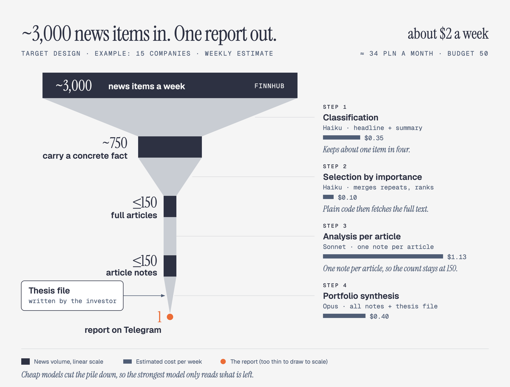
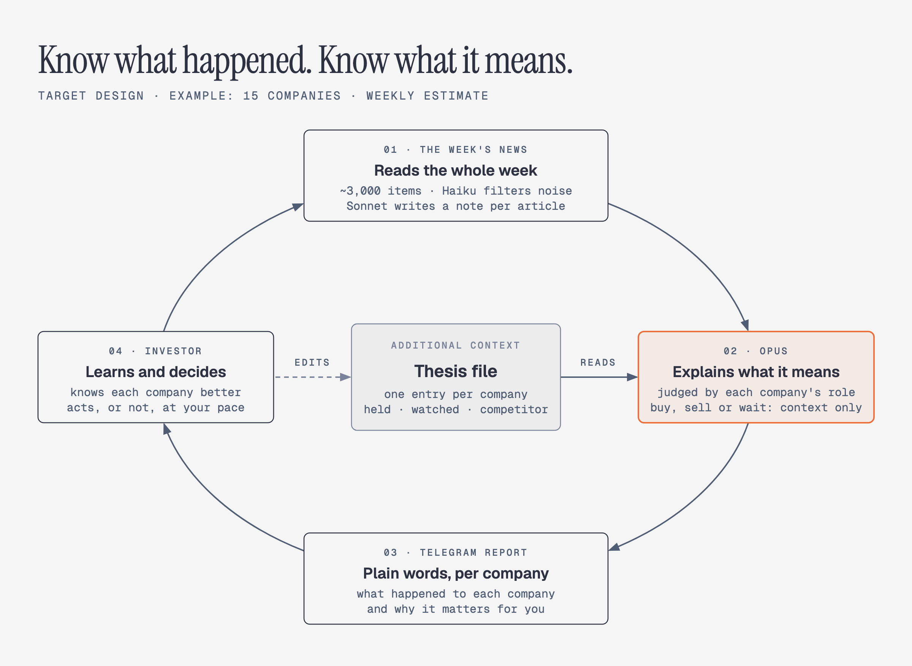
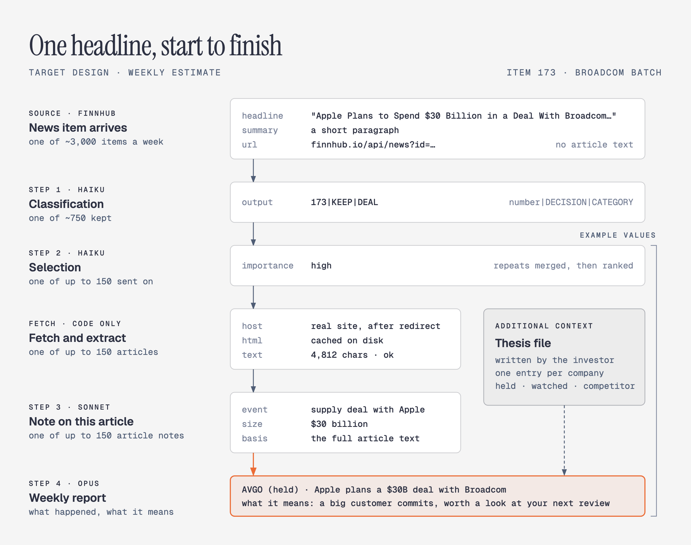

# Stock Market News Digest

Filters financial news for a selected set of specific tickers (AVGO, AMD, SNOW, MU, CRDO etc.), keeping only items with a concrete, verifiable fact about the company.

<picture>
  <source media="(prefers-color-scheme: dark)" srcset="assets/pipeline-funnel-dark.png">
  
</picture>

Target design, shown for an example portfolio of 15 companies (main holdings plus their closest competitors). Volumes and costs are estimates.

Many individual investors struggle with the same thing: keeping track of the companies they own or watch takes a lot of effort. Staying informed means scrolling X and reading articles across dozens of sites. Most of what you find there is shallow, and the few important developments are easy to miss. Most portfolio decisions don't happen daily; they come on a fixed rhythm, such as a monthly purchase or a quarterly review around earnings. What investors need between those moments is a low-effort way to get **only the important news, explained in depth**.

The problem is the volume. A single large company can produce 250 or more news items a week: in a July test run, AMD and Micron each returned about 250 items covering only the last six of the eight days requested, with nothing earlier. Five companies gave 710 items even so, and most of them are noise: price moves, market roundups, opinion pieces, the same story repeated by ten sites. The few that matter are easy to miss: results and guidance, contracts, acquisitions, analyst actions, insider trades, management changes.

This project does that sorting automatically. Every week it goes through the whole stream, drops the noise, and sends a report to Telegram that goes past "what happened" to **what it means for the business**. Examples: how an acquisition changes what the company will be selling in two years, or how a competitor's warning affects demand. For each company, the report says whether the week confirms the reason for holding it, weakens it, or calls for a decision. "Nothing changed" is a valid and common answer. The system filters and explains; the decision stays with the investor.

Two constraints shape the design:

- **Scale:** an example portfolio of 15 companies (main holdings plus their closest competitors) means around 3,000 news items a week, an estimate extrapolated from a five-company test week. Even 8 to 10 companies produce well over a thousand, depending on how large they are (one large company alone passes 250). Judging a thesis needs full article text, and a few hundred articles don't fit into one model call. So the work is split into cheap steps that each shrink the volume before a stronger (more expensive) model sees it.
- **Budget:** the whole pipeline has to run under ~50 PLN (~$12) a month. This decides which model does which step — see the estimate in [issue #7](https://github.com/mattbuildz/stock-market-news-digest/issues/7).

## How it works

Target pipeline: each step is cheap relative to the next and cuts the volume down before it. Fetching content is the only step that ever hits an outside page. An optional thesis file, written by the investor, gives the last step extra context.

<picture>
  <source media="(prefers-color-scheme: dark)" srcset="assets/weekly-loop-dark.png">
  
</picture>


| #   | Step                 | Model         | Input                                                          | Output                         | Status      |
| --- | -------------------- | ------------- | -------------------------------------------------------------- | ------------------------------ | ----------- |
| 1   | Classification       | Haiku         | headline + summary, per news item                              | KEEP/REJECT + category         | **built**   |
| 2   | Selection            | Haiku         | headlines + summaries of one company's KEEP items              | importance level per item, repeated stories merged | planned     |
| —   | Fetch article HTML   | — (code only) | links of the items step 2 selected                             | cached HTML                    | **built**   |
| —   | Extract article text | — (code only) | cached HTML                                                    | article text, validated        | in progress |
| 3   | Analysis per article | Sonnet        | full article text                                              | one note per article           | planned     |
| 4   | Portfolio synthesis  | Opus          | all notes from step 3 + the investor's thesis file (one entry per company, written for its role: held, watched or competitor) | one weekly report: the state of each thesis | planned |


Steps 1 and fetching are what `pipeline/` runs today. Steps 2–4 are tracked in [issue #7](https://github.com/mattbuildz/stock-market-news-digest/issues/7).

Fetching trusts neither Finnhub's `source` field ("Yahoo" hides at least 8 different real hosts) nor HTTP 200 (6 of 24 successful requests in the 30-page test were a cookie consent screen). Pages are checked by the real host after the redirect, the page title and the length of the extracted text. A full browser `User-Agent` removes most blocks.

One headline through every step (example values after step 2):

<picture>
  <source media="(prefers-color-scheme: dark)" srcset="assets/one-headline-dark.png">
  
</picture>

## Example run


| Step                                                                     | Numbers                                                                                 |
| ------------------------------------------------------------------------ | --------------------------------------------------------------------------------------- |
| Classification (710 news items, AVGO/AMD/MU/CRDO/SNOW, July 15–22, 2026) | **180 KEEP** (25.4%), 530 REJECT, 0 format errors                                       |
| Fetching 30 of those pages                                               | 24 returned HTTP 200, of which **6** were a Yahoo cookie consent screen, not an article |
| The 4 KEEP items in that batch of 30                                     | **0 produced an article** — 3 hit the consent screen, 1 got blocked (403)               |
| Fetching 300 pages later (all 186 AVGO items + the first 114 AMD items)  | **229 (76%)** were real articles, median 3,450 characters of text. The rest: 23 blocked pages, 23 never downloaded (21 refused by robots.txt, 2 timeouts), 14 HTTP errors, 11 too short or empty |
| The 67 KEEP items among those 300                                        | **47 (70%)** produced an article: AVGO 23 of 30, AMD 24 of 37                           |


Full breakdown, per-category numbers and example decisions: [`examples/`](examples/).

## Decision history

Stage 1 went through 13 prompt iterations trying to get a *selection* prompt (pick the important news out of a list) to behave consistently — it kept 4% of one batch and 93% of another in the same run. Switching to *classification* (KEEP/REJECT on every single item, independently) fixed that: every larger company now lands between 18% and 34% KEEP. The full history is in the issues, starting from [#1](https://github.com/mattbuildz/stock-market-news-digest/issues/1).

## Known limitations

- **Full article text is the main blocker.** Finnhub, and every free news API checked (NewsAPI, GNews, Marketaux, Alpha Vantage, Tiingo), returns only a headline, a summary and a link — never the full text.
- **Scraping works for some sites, not others.** In the 300-page run 76% of pages returned a real article, and so did 70% of the items stage 1 kept. 247wallst, Trefis, Motley Fool and Stocktwits worked every time, Yahoo Finance 80 times out of 90. SeekingAlpha blocks (1 of 17 got through) and Barchart answers with an empty page (0 of 6). In the earlier 30-link test the Yahoo consent screen swallowed all 4 kept items; in the 300-page run only 4 pages hit it.
- **Paid APIs with full text start around €50/month** (GNews Essential), above this project's ~50 PLN/month budget for the whole pipeline.
- **Planned workaround:** official SEC filings (Form 4, 8-K) for news backed by a filing, since results, material agreements, insider trades and management changes can be pulled straight from EDGAR instead of scraping an article about them ([issue #8](https://github.com/mattbuildz/stock-market-news-digest/issues/8)).
- **Stage 1's error rate is not measured yet.** No hand-labeled test set exists, so it is an estimate from manual review, not a measured recall. A single run can't stand in for it: even at `temperature=0`, two runs of the same prompt on identical input (710 news items) disagreed on KEEP/REJECT for 23 items (3.2%) and on the decision or the category for 74 (10.4%). Quality has to be measured across several runs on a fixed, hand-labeled set ([issue #6](https://github.com/mattbuildz/stock-market-news-digest/issues/6)).
- **One Finnhub response looks capped at about 250 items.** For July 15–22, AMD returned 247 items and Micron 249, and neither has anything before July 17. The 710 items in the example run therefore undercount, which is why the weekly volume above is an estimate.

## Running it

Requires Python 3.14+.

```bash
pip install -r requirements.txt
```

### API keys — where to get them

| Variable | Where |
|---|---|
| `FINNHUB_API_KEY` | [Finnhub](https://finnhub.io/) → sign up → dashboard → API key (free tier is enough to start) |
| `ANTHROPIC_API_KEY` | [Anthropic Console](https://console.anthropic.com/) → API Keys → Create key |

Never put real key values in this file, in the repo, or in screenshots.

### API keys — this terminal only

**Mac / Linux**

```bash
export FINNHUB_API_KEY=your_key_here
export ANTHROPIC_API_KEY=your_key_here
```

**Windows (PowerShell)**

```powershell
$env:FINNHUB_API_KEY="your_key_here"
$env:ANTHROPIC_API_KEY="your_key_here"
```

These last until you close the terminal.

### API keys — permanent (survive new terminals)

**Mac / Linux** — add the same `export …` lines to `~/.zshrc` (zsh) or `~/.bashrc` (bash), save, then open a new terminal or run `source ~/.zshrc`.

**Windows** — set user environment variables once (they apply to **new** PowerShell / CMD / IDE windows, not the one already open):

1. Start → search **Edit environment variables for your account** (or *Edit the system environment variables* → **Environment Variables…**).
2. Under *User variables for …* → **New…** → Variable name `FINNHUB_API_KEY`, Variable value = your key → OK. Repeat for `ANTHROPIC_API_KEY`.
3. Close every open terminal and IDE window, then open them again (so they reload the environment).

Or in PowerShell (user scope — same effect; still needs a **new** terminal afterward):

```powershell
[System.Environment]::SetEnvironmentVariable("FINNHUB_API_KEY", "your_key_here", "User")
[System.Environment]::SetEnvironmentVariable("ANTHROPIC_API_KEY", "your_key_here", "User")
```

Check in a new PowerShell window: `echo $env:FINNHUB_API_KEY` (should print the key; do not screenshot or paste that output into chats/repos).

### Run the scripts

Run from the project root — the scripts resolve paths relative to the working directory:

```bash
python pipeline/stage1_classify_news.py
python pipeline/stage2_fetch_html.py
```

Note: stage 1 calls a paid API (Anthropic) and stage 2 calls Finnhub — every run has a real cost.

## Disclaimer

This is a news filter and explainer, not investment advice. It says what happened and why it might matter; every decision stays with the investor.

## License

MIT. See [LICENSE](LICENSE).
